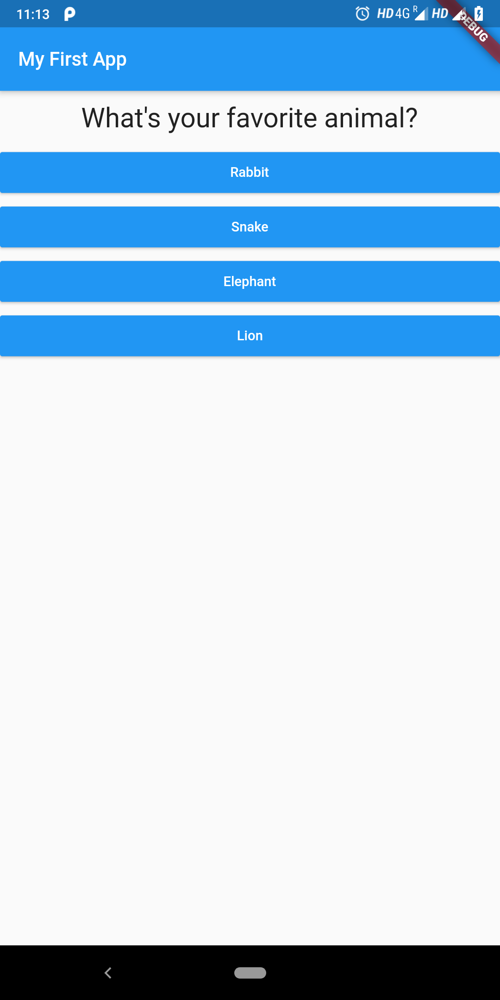
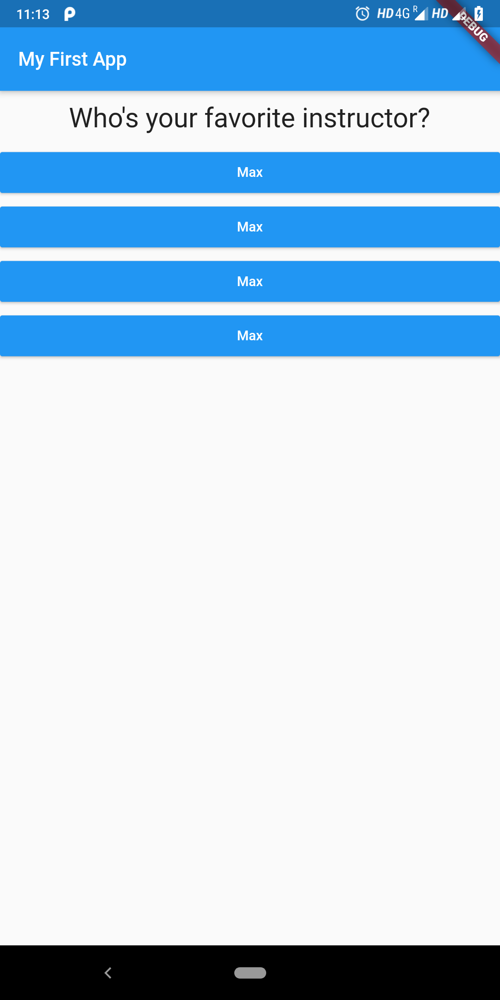
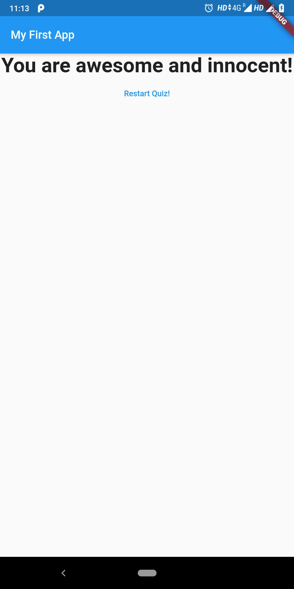

# quiz_app

A new Flutter project.

## Getting Started

This project is a starting point for a Flutter application.

A few resources to get you started if this is your first Flutter project:

- [Lab: Write your first Flutter app](https://flutter.dev/docs/get-started/codelab)
- [Cookbook: Useful Flutter samples](https://flutter.dev/docs/cookbook)

For help getting started with Flutter, view our
[online documentation](https://flutter.dev/docs), which offers tutorials,
samples, guidance on mobile development, and a full API reference.

# About
This is a very basic app built in flutter to get a brief knowledge about the various functionalities about flutter and dart. This app features interacting with different widgets and handling the states of the application, performing button actions and updating the contents displayed on the screen dynamically.
# Screenshots
   
